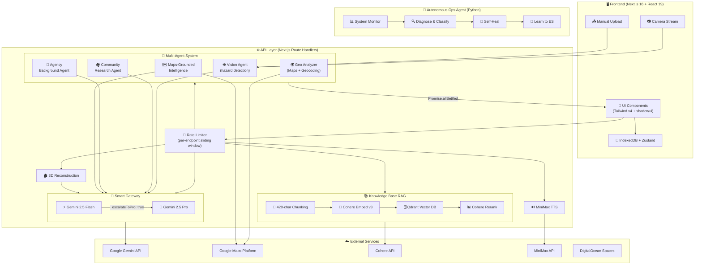

# RentRadar

[](https://github.com/Jerry2003826/unihack3-13/actions/workflows/ci.yml)
[](https://170-64-160-8.sslip.io/api/health)
[](#17-project-timeline)
[](#168-test-coverage)
[](LICENSE)


RentRadar is an AI-assisted rental inspection and decision-support system. It combines live scan guidance, image analysis, location intelligence, pre-lease advice, multi-property comparison, approximate 3D room views, exportable reports, and an autonomous server-ops agent in one monorepo.

> **Quick Start — Try it now:** <https://170-64-160-8.sslip.io/>

## System Architecture



## 1. Features

- **Live Inspection** — real-time camera scanning with AI-guided targets, hazard re-inspection, and MiniMax voice alerts
- **Manual Upload** — batch photo analysis with automatic hazard detection
- **Report Center** — risk scoring, geo/community/agency intelligence, evidence summary, pre-lease advice, 3D room view
- **Multi-Property Compare** — weighted scoring across budget, commute, noise, lighting, condition, agency, and community
- **History** — local IndexedDB persistence of past searches and comparisons
- **Knowledge Base** — RAG-enhanced rental advice powered by Cohere + Qdrant
- **Smart Gateway** — dynamic model routing that lets Gemini Flash automatically escalate overwhelmingly complex tasks (like rigorous math proofs or deep logical reasoning) to Gemini Pro invisibly
- **Autonomous Server Ops Agent** — a continuously running AI workflow that monitors, diagnoses, and self-heals the production server (see [Section 12](#12-autonomous-server-ops-agent))

## 2. Tech Stack

### Frontend

- Next.js 16.1.6, React 19, TypeScript
- Tailwind CSS v4, shadcn/ui, Framer Motion
- Zustand, IndexedDB (idb), Recharts
- @vis.gl/react-google-maps, Three.js
- html2canvas + jsPDF

### Backend / Server

- Next.js Route Handlers, Zod
- @google/genai (Gemini 2.5 Flash / Pro)
- Jimp, DigitalOcean Spaces (S3-compatible presigned upload)
- MiniMax TTS
- Google Maps Platform (Geocoding, Places, Routes, Static Maps, Maps JS)

### Shared Packages

- `packages/contracts` — Zod schemas, shared types
- `packages/ui` — shared UI components

### Ops Agent (Python)

- Python 3.10+, Elasticsearch 8, OpenAI-compatible LLM
- YAML workflow engine, systemd / Docker deployment

## 3. Repository Structure

```text
Inspect/
├── apps/
│   ├── web/                    # Frontend (user-facing UI)
│   └── api/                    # API (server-side routes)
├── packages/
│   ├── contracts/              # Shared schemas / types
│   └── ui/                     # Shared UI components
├── agentic-workflow/           # Autonomous server ops agent (Python)
│   ├── src/agentic_workflow_agent/
│   ├── workflows/              # YAML workflow definitions
│   ├── deploy/                 # systemd + VM setup scripts
│   ├── Dockerfile
│   └── docker-compose.yml
├── tests/                      # Vitest / Playwright
├── package.json                # Monorepo root scripts
├── pnpm-workspace.yaml
└── README.md
```

## 4. Pages

| Route | Description |
|-------|-------------|
| `/` | Home page — Live / Manual entry points |
| `/radar` | Live scan preparation and status |
| `/scan` | Camera scanning, guided re-inspection, 3D Scan Studio |
| `/manual` | Photo upload and analysis |
| `/report/[id]` | Inspection report |
| `/compare` | Multi-property comparison entry |
| `/compare/[id]` | Comparison report details |
| `/history` | Search and comparison history |

## 5. API Endpoints

| Method | Path | Description |
|--------|------|-------------|
| GET | `/api/health` | Health check |
| POST | `/api/upload/sign` | Presigned upload URL |
| POST | `/api/storage/object` | Object storage |
| POST | `/api/analyze` | Image analysis |
| POST | `/api/analyze/live` | Live frame analysis |
| POST | `/api/intelligence` | Location intelligence |
| POST | `/api/negotiate` | Lease negotiation advice |
| POST | `/api/knowledge/query` | Knowledge base RAG query |
| POST | `/api/compare` | Multi-property comparison |
| POST | `/api/geocode/reverse` | Reverse geocoding |
| POST | `/api/checklist/prefill` | Checklist auto-fill |
| POST | `/api/listing/discover` | Listing discovery |
| POST | `/api/listing/extract` | Listing extraction |
| POST | `/api/maps/static` | Static map generation |
| POST | `/api/assets/sign-get` | Asset access signing |
| POST | `/api/tts/alert` | Voice alert synthesis |
| POST | `/api/scan/3d/reconstruct` | 3D room reconstruction |

## 6. Getting Started

### Prerequisites

- Node.js >= 20, pnpm >= 9
- macOS / Linux / Windows

### Install and Run

```bash
pnpm install
cp .env.example .env.local
pnpm dev
```

Or start frontend and API separately:

```bash
pnpm dev:web   # http://localhost:3000
pnpm dev:api   # http://localhost:3001
```

### Build and Start

```bash
pnpm build
pnpm start
```

## 7. Environment Variables

### Required

```bash
GEMINI_API_KEY=
GOOGLE_MAPS_API_KEY=
NEXT_PUBLIC_GOOGLE_MAPS_API_KEY=
```

### Gemini Models

```bash
GEMINI_VISION_MODEL=gemini-2.5-flash
GEMINI_LIVE_MODEL=gemini-2.5-flash
GEMINI_SCENE_EXTRACT_MODEL=gemini-2.5-flash
GEMINI_SCENE_SYNTHESIS_MODEL=gemini-2.5-pro
GEMINI_GROUNDED_MODEL=gemini-2.5-flash
GEMINI_INTELLIGENCE_MODEL=gemini-2.5-flash-lite
GEMINI_REASONING_MODEL=gemini-2.5-pro
```

### MiniMax TTS

```bash
MINIMAX_API_KEY=
MINIMAX_API_BASE=https://api.minimax.io
MINIMAX_TTS_MODEL=speech-2.8-hd
MINIMAX_TTS_VOICE_ID=English_expressive_narrator
MINIMAX_TTS_FORMAT=mp3
```

### Frontend Public

```bash
NEXT_PUBLIC_API_BASE_URL=http://localhost:3001
NEXT_PUBLIC_ENABLE_DEMO_MODE=false
```

### DigitalOcean Spaces (optional, needed for uploads)

```bash
DO_SPACES_REGION=
DO_SPACES_BUCKET=
DO_SPACES_ENDPOINT=
DO_SPACES_KEY=
DO_SPACES_SECRET=
```

### CORS and Deployment

```bash
DEPLOY_TARGET=              # local | api | frontend
CORS_ALLOWED_ORIGINS=       # comma-separated origins
```

## 8. Core Workflows

### 8.1 Live Scan Workflow

```
Camera Start → Select Room Type → Begin Scan
                                       │
                                  Vision Engine
                                  Analysis Loop
                                       │
                    ┌──────────────────┼──────────────────┐
                    ▼                  ▼                  ▼
              AI Analysis        MiniMax TTS        Target Guidance
              /analyze/live      Voice Alerts       Visual Prompts
                    │                  │                  │
                    └──────────────────┼──────────────────┘
                                       ▼
                                 Re-inspection
                                 (high risk)
                                       ▼
                                 End Scan →
                                 Generate Report
```

**Key components:**
- `useCameraStream.ts` — camera capture and frame extraction
- `useVisionEngine.ts` — vision analysis engine (60 req/min rate limit)
- `liveGuidance.ts` — guided target system (predefined sequences per room type)
- `liveRoomState.ts` — room scan state machine

**Room verdict logic:** `pass` | `caution` | `fail` | `insufficient-evidence`

### 8.2 Report Generation Workflow

```
Scan Complete → Build Snapshot → Save to IndexedDB → Navigate to Report
                                                          │
                                     Progressive Enhancement Loading
                                          │         │         │         │
                                        Geo     Community   Agency   Decision
                                       /intel    /intel     /intel   /negotiate
                                          │         │         │         │
                                          └─────────┴─────────┘
                                                    │
                                             Knowledge Base
                                             /knowledge/query
```

Features: progressive enhancement, graceful degradation per module, `normalizeReportSnapshot()` for data integrity.

### 8.3 Intelligence Gathering (Parallel Multi-Agent)

```typescript
const [geoResult, groundedResult, communityResult, agencyResult] =
  await Promise.allSettled([
    analyzeGeoContext({ address, coordinates, targetDestinations, depth }),
    summarizeMapsGroundedIntelligence({ address, coordinates, agency, depth }),
    researchCommunity({ address, coordinates, propertyNotes, depth }),
    analyzeAgencyBackground({ agency, depth }),
  ]);
```

| Agent | Responsibility | Data Sources |
|-------|---------------|--------------|
| `geoAnalyzer.ts` | Geography analysis | Google Maps Geocoding, Places, Routes |
| `searchAgent.ts` | Agency background | Tavily Search, Gemini Grounded |
| `communityResearchAgent.ts` | Community research | Google Search, Gemini |
| `mapsGroundedIntelligence.ts` | Map fusion | Google Maps + Gemini |

Multi-source fusion detects conflicts (e.g., map says convenient transit but web evidence shows noise issues) and reports them with balanced perspective.

### 8.4 Knowledge Base RAG

```
Query → Cohere Embedding → Qdrant Vector DB → Rerank (optional) → Top-K → Gemini Generate
```

- Document chunking: 420-char sliding window with 80-char overlap
- Embedding: Cohere embed-english-v3
- Vector DB: Qdrant (local or remote)
- Retrieval: Dense + optional rerank
- Fallback: keyword matching when RAG is unavailable

### 8.5 Comparison Workflow

Inputs: 2–5 candidate reports, factor weights (budget, commute, noise, lighting, condition, agency, community), preference profile.

Outputs: ranked candidates, winning reasons, trade-off analysis, knowledge base matches, document checklist.

### 8.6 3D Room Reconstruction (AI-driven, no LiDAR)

```
3–8 Room Photos → Per-image Analysis (Gemini) → Multi-view Fusion → Scene Synthesis (Gemini Pro)
```

Produces: approximate dimensions, openings (doors, windows, balconies), furniture layout, and hazard markers.

### 8.7 Checklist Prefill

Fields classified as remote-friendly (e.g., `security.nightEntryRoute`, `noise.lateNight`) are auto-filled from intelligence; manual-priority fields (e.g., `utilities.hotWater`, `security.doorLocks`) are flagged for on-site verification.

### 8.8 Listing Discovery

- **Discover API**: address → candidate listing URLs (12 req / 2 min)
- **Extract API**: listing URL → details (title, summary, rent, features, checklist tips; 10 req / 2 min)

## 9. Deployment Architecture

### Hybrid Strategy

- **Application layer**: PM2 manages Node.js processes (non-containerized)
- **Vector database**: Docker runs Qdrant (only containerized component)
- **Ops agent**: systemd service (Python, runs independently)

### Qdrant Docker

```bash
docker run -d \
  --name qdrant \
  --restart unless-stopped \
  -p 127.0.0.1:6333:6333 \
  -v /opt/inspect-ai/qdrant_storage:/qdrant/storage \
  qdrant/qdrant:latest
```

### VPS Architecture

```
┌──────────────────────────────────────────────────────────────┐
│                          VPS Server                          │
├──────────────────────────────────────────────────────────────┤
│                                                              │
│  Nginx (80/443) ──── PM2 ──── inspect-web (:3000)           │
│                         └──── inspect-api (:3001)            │
│                                     │                        │
│                               Docker Qdrant (:6333)          │
│                                                              │
│  systemd ──── agentic-workflow (Python, loop mode)           │
│               Auto health checks every hour                  │
│               Self-healing + learning to Elasticsearch       │
│                                                              │
└──────────────────────────────────────────────────────────────┘
```

### Deployment Options

| Option | Frontend | API | Vector DB | Ops Agent | Best For |
|--------|----------|-----|-----------|-----------|----------|
| **A — easiest** | Vercel | Vercel | None | None | Quick start, no RAG |
| **B — balanced** | Vercel | Render/Railway | Managed Qdrant | None | Medium scale |
| **C — full control** | VPS | VPS | Docker Qdrant | systemd | Full features |

## 10. AI Architecture

### Multi-Model Coordination

| Task | Primary Model | Fallback | Rationale |
|------|--------------|----------|-----------|
| Image analysis | Gemini 2.5 Flash | — | Fast, cheap, multimodal |
| Geo intelligence | Gemini + Google Maps | Web search | Grounding-enhanced |
| Community research | Gemini 2.5 Flash | Search grounding | Multi-pass search |
| Agency background | Gemini 2.5 Flash | Search grounding | Multi-pass search |
| Knowledge Base RAG | Cohere Embed | Cohere Rerank | Specialized embedding/ranking |
| Smart Gateway (Routing) | Gemini 2.5 Flash | Gemini 2.5 Pro | Flash acts as an evaluator and automatically escalates strict JSON schemas to Pro if a prompt is too difficult to answer directly |
| Answer generation | Gemini 2.5 Flash | Local fallback | Cost/quality balance |
| Voice synthesis | MiniMax TTS | — | English expressive narration |
| Server ops | GLM-5 via apiyi.com | Retry with backoff | Tool-calling capable |

### Core Gateway Mechanics

The **Smart Gateway** relies on a robust schema-wrapping mechanism instead of native tool calling (which conflicted with strict JSON parsing).
1. We inject an optional `_escalateToPro: boolean` into the requested target Zod schema.
2. The `gemini-2.5-flash` model evaluates if the query is too complex (e.g. requires advanced multi-step proofs).
3. If it is complex, it outputs only the `_escalateToPro: true` flag natively as JSON.
4. Our AI interceptor reads this raw JSON flag natively and seamlessly forwards the exact prompt to `gemini-2.5-pro` (`GEMINI_REASONING_MODEL`), without ever breaking strict type validation.

### Prompt Engineering

- **Structured output**: `callGeminiJson()` enforces JSON via Zod schema + `responseJsonSchema`
- **Role definition**: "tenant-visible risks" bounds the analysis scope
- **Constraint injection**: character limits, category enums, dynamic room type context

### Error Handling (4-Layer Degradation)

| Layer | Scope | Strategy |
|-------|-------|----------|
| 1 — Request | Route handler | Schema validation fail → empty result; rate limit → 429 + Retry-After |
| 2 — Service | Agent | API timeout → fallback data; no search results → local KB |
| 3 — Model | AI call | Gemini fail → `fallbackReason`; `withTimeout()` retry |
| 4 — Data | Fallback builder | Generate default/prompt content; keep UI usable |

### Cost Optimization

| Scenario | Model | Cost |
|----------|-------|------|
| Vision analysis | Gemini 2.5 Flash | $ |
| Simple intelligence | Gemini 2.5 Flash-lite | $ |
| Complex reasoning | Gemini 2.5 Pro | $$ |
| Embedding | Cohere embed-v4.0 | $ |
| Reranking | Cohere rerank-v4.0-pro | $$ |

Caching: in-memory knowledge docs, Gemini client singleton, search result scoring and filtering.

## 11. Type Safety and Data Architecture

### Contracts Package

```typescript
// packages/contracts/src/schemas.ts
export const HazardSchema = z.object({
  id: z.string(),
  type: z.enum(["structural", "electrical", "plumbing", "environmental"]),
  severity: z.enum(["low", "medium", "high", "critical"]),
  description: z.string(),
  evidence: z.array(z.string()),
});
```

### Offline-First

- IndexedDB stores report snapshots
- Zustand + persist for state persistence
- Session recovery on page refresh

### Rate Limits

- `/api/analyze/live` — 60 req / min
- `/api/listing/discover` — 12 req / 2 min
- `/api/listing/extract` — 10 req / 2 min

## 12. Autonomous Server Ops Agent

The `agentic-workflow/` directory contains a standalone Python agent that autonomously monitors, diagnoses, and remediates the production server. Once deployed, it starts working immediately with no human intervention.

### Architecture

```text
systemd / Docker (loop mode)
  → entrypoint.sh
      → YAML Workflow Runner
          → Agent Loop (plan → tool → observe → answer)
              → execute_bash_command    (real server commands)
              → fetch_system_logs       (journalctl error logs)
              → search_knowledge_base   (Elasticsearch RAG)
              → search_web              (DuckDuckGo fallback)
              → learn_resolution        (write fixes back to ES)
              → invoke_elastic_agent    (optional Kibana sub-agent)
          → Structured Ops Report
```

### How It Works

The default workflow (`workflows/ubuntu_auto_ops.yaml`) implements a multi-tiered strategy:

1. **Gather symptoms** — `fetch_system_logs`, `execute_bash_command` (`top`, `df -h`, `free -m`, etc.)
2. **Classify severity**:
   - **Tier 1 (simple)**: disk full, service stopped, memory leak → auto-remediate immediately
   - **Tier 2 (complex)**: kernel panic, unknown tracebacks → search KB first, then web, then remediate
3. **Self-heal** — executes fix commands (`apt-get clean`, `systemctl restart`, firewall rules, etc.)
4. **Self-learn** — writes successful resolutions back to Elasticsearch via `learn_resolution`
5. **Report** — structured ops report with diagnosis, actions, and recommendations

In `loop` mode this cycle repeats every hour (configurable). Failed iterations retry with exponential backoff.

### Real-World Example

On first deployment to the production VPS, the agent autonomously:
- Detected SSH brute-force attacks (330+ attempts from a single IP)
- Installed and configured **fail2ban** (24h ban for SSH brute force)
- Enabled **UFW firewall** (allow 22/80/443/3000/3001 only)
- Hardened SSH (`PermitRootLogin prohibit-password`)

### Why This Is Not Ordinary RAG

| Feature | Ordinary RAG | This Agent |
|---------|-------------|------------|
| Retrieval | Fixed, one-shot | Dynamic, multi-round, agent-decided |
| Decision | None | Plan → tool → observe → decide again |
| Actions | Read-only | Executes real bash commands |
| Learning | None | Writes resolutions back to ES |
| Sub-agents | None | Can delegate to Kibana Agent Builder |

### Ops Agent Deployment

**systemd (production VPS):**

```bash
cd agentic-workflow
bash deploy/setup-vm.sh
sudo nano /opt/agentic-workflow/.env
sudo systemctl start agentic-workflow
sudo systemctl enable agentic-workflow
sudo journalctl -u agentic-workflow -f
```

**Docker Compose:**

```bash
cd agentic-workflow
cp .env.example .env
docker compose up -d
```

### Ops Agent Environment Variables

| Variable | Default | Description |
|----------|---------|-------------|
| `ELASTIC_URL` | — | Elasticsearch endpoint |
| `ELASTIC_API_KEY` | — | Elasticsearch API key |
| `OPENAI_API_KEY` | — | OpenAI-compatible API key |
| `OPENAI_BASE_URL` | — | Custom LLM base URL |
| `OPENAI_CHAT_MODEL` | `glm-5` | Chat model name |
| `LLM_REQUEST_TIMEOUT` | `120` | Request timeout (seconds) |
| `LLM_MAX_RETRIES` | `3` | Retry count on transient errors |
| `RUN_MODE` | `workflow` | `loop` / `workflow` / `ask` / `chat` |
| `LOOP_INTERVAL_SECONDS` | `3600` | Interval between loop iterations |
| `BOOTSTRAP_ON_START` | `true` | Create ES indices on startup |

### Resilience

- **LLM timeouts**: retries with exponential backoff (2s, 4s, 8s …)
- **Agent loop errors**: caught and returned as error report, never crashes the process
- **Workflow failures**: short retry delay (60s × failure count, capped at 5 min) instead of full interval
- **Process crashes**: systemd `Restart=on-failure` / Docker `restart: unless-stopped`

## 13. Testing

### Unit Tests

```bash
pnpm test:unit
```

Vitest: utility functions, store logic, type conversions.

### E2E Tests

```bash
pnpm test:e2e
```

Playwright: full user flows, cross-page state, responsive layout.

## 14. Security Best Practices

- All API keys stored server-side in `.env.local`
- Frontend uses only `NEXT_PUBLIC_` prefixed public config
- CORS whitelist restricts cross-origin requests
- Uploads use presigned URLs — no key exposure
- Input validation via Zod schemas
- Type-safe outputs throughout
- Production server hardened by the autonomous ops agent (fail2ban, UFW, SSH)

## 15. Development Guide

### Adding a New Page

1. Create directory under `apps/web/src/app/`
2. Add `page.tsx` and optional `loading.tsx`
3. Use `useSessionStore` for state management
4. Add route to `next.config.ts` headers config

### Adding a New API

1. Create directory under `apps/api/src/app/api/`
2. Add `route.ts` with HTTP method handlers
3. Use `ensureCrossOriginAllowed` for CORS
4. Validate input with Zod schemas
5. Add types to `packages/contracts`

### Adding a New Agent

1. Create file in `apps/api/src/lib/agents/`
2. Export a `run` function accepting context parameters
3. Use `callGemini` or `callGeminiJson` for model calls
4. Return structured results

## 16. Engineering Deep-Dive: What We Actually Built and Why

> This section explains the hard technical decisions, failure modes we handled, and measured performance — not just what features exist, but **why they work the way they do**.

### 16.1 Why Multi-Model Routing (Smart Gateway)

**Problem:** Gemini 2.5 Flash is fast and cheap but occasionally produces shallow or incorrect answers on complex reasoning tasks (e.g., multi-step risk analysis, legal clause interpretation). Gemini 2.5 Pro is more capable but 3–5× slower and more expensive.

**Why not just use Pro everywhere?** Cost and latency. A single live scan session fires ~60 vision calls/min. At Pro pricing, this becomes economically unsustainable. Flash handles 95%+ of queries adequately.

**Our solution — Schema-Wrapping Gateway:**
- We inject an optional `_escalateToPro: boolean` into every Zod schema sent to Flash.
- Flash evaluates its own confidence. If overwhelmed, it sets the flag instead of guessing.
- Our interceptor detects this via raw `JSON.parse` (not Zod — to avoid validation crashes on incomplete schemas) and transparently re-routes to Pro.
- The escalation path gets a 1.5× timeout budget (30s vs 20s default) to accommodate Pro's longer thinking time.

**Why not use Gemini's native tool calling for this?** We tried. The Gemini API throws `ApiError: Function calling with a response mime type: 'application/json' is unsupported`. Tool calling and strict JSON mode are mutually exclusive. Schema wrapping bypasses this entirely.

**Hard lesson learned:** The `zod-to-json-schema` library silently outputs `{}` in monorepo environments due to multiple Zod `instanceof` chains. We wrote a custom `createGeminiSchema()` mapper using stable `constructor.name` lookups to guarantee correct schema translation across all deployment targets.

### 16.2 Why This RAG Architecture

**Problem:** Tenants need actionable rental advice grounded in Australian tenancy law and best practices, but Gemini hallucinates legal advice when unconstrained.

**Why Cohere + Qdrant instead of just prompting Gemini?**
- Gemini has no guaranteed access to niche Australian rental law documents.
- RAG lets us control exactly which knowledge the model can cite — no hallucinated legal references.
- Cohere's `embed-english-v3` + `rerank-v4.0-pro` consistently outperformed Gemini's own embedding on our domain-specific content in informal testing.

**Pipeline details:**
- **Chunking:** 420-char sliding window with 80-char overlap, sentence-boundary-aware splitting (not naive character slicing).
- **Retrieval:** Dense vector search via Qdrant, top-12 candidates → Cohere rerank → top-K (configurable, default 5).
- **Generation:** Gemini Flash with strict `knowledgeAnswerSchema` enforcement (summary ≤180 chars, 2–4 key points ≤120 chars each, confidence rating).

**Fallback chain (3 layers):**
1. RAG runtime missing (no Qdrant/Cohere keys) → falls back to keyword-based local search over cached knowledge docs.
2. Rerank fails → uses raw retrieval scores, continues pipeline.
3. Answer generation fails → returns pre-built fallback answer from matched snippets with `confidence: "low"`.

### 16.3 Handling Structured Output Failures

Every AI call goes through `callGeminiJson()` which enforces strict `responseMimeType: "application/json"` + `responseJsonSchema`. But models still fail:

| Failure Mode | How We Handle It | Where |
|---|---|---|
| Model returns empty text | `throw Error("empty response")` → caught by caller, returns `fallbackReason` | `ai.ts:L69-71` |
| JSON doesn't match Zod schema | `schema.parse()` throws → caller catches, returns degraded result | Every agent |
| Model times out | `withTimeout()` wrapper rejects after deadline → caller returns fallback | All AI calls |
| Gateway escalation JSON incomplete | Native `JSON.parse` + property check (not Zod) avoids crash | `ai.ts:L108-111` |
| Vision analysis fails entirely | Returns `{ hazards: [], fallbackReason: "gemini_analyze_failed" }` | `geminiService.ts:L103-111` |

**Design principle:** No single AI failure should crash the request. Every agent function returns a typed result with an optional `fallbackReason` field, letting the UI render partial data with appropriate caveats.

### 16.4 Rate Limiting and Latency Budgets

**Server-side rate limits (per-endpoint, in-memory sliding window):**

| Endpoint | Rate Limit | Timeout Budget |
|---|---|---|
| `/api/analyze/live` (live scan) | 60 req / 60s | 25s (vision) |
| `/api/analyze` (manual upload) | 45 req / 60s | 25s |
| `/api/intelligence` | 12 req / 60s | 10–18s (parallel agents) |
| `/api/negotiate` | 8 req / 60s | 8s |
| `/api/knowledge/query` | 30 req / 60s | 9s (RAG generation) |
| `/api/listing/discover` | 12 req / 120s | 7s |
| `/api/listing/extract` | 10 req / 120s | 8–12s |
| `/api/compare` | 12 req / 60s | — |
| `/api/tts/alert` | 20 req / 60s | 10s |
| `/api/maps/static` | 18 req / 60s | 10s |
| `/api/scan/3d/reconstruct` | 12 req / 60s | 8–14s |

All rate-limited endpoints return `429 + Retry-After` when exhausted. Smart Gateway escalation adds 1.5× to the base timeout for Pro calls.

### 16.5 Hazard Detection: False Positive / False Negative Handling

**The core challenge:** Vision models over-detect (false positives) and occasionally miss subtle issues (false negatives).

**Strategies implemented:**
- **Severity gating:** Only `Critical` and `High` severity observations trigger automatic recording during live scan. `Medium` and `Low` are displayed as guidance but not persisted without user confirmation.
- **Bounding-box IoU confirmation:** Live observations must appear in ≥2 consecutive focused frames with IoU (Intersection-over-Union) overlap ≥ threshold before being confirmed as a real hazard. This eliminates transient false positives from motion blur or lighting changes.
- **Multi-image deduplication:** Manual upload mode runs `dedupeHazards()` across all photos to merge duplicate findings (e.g., the same crack photographed from two angles).
- **Constraint injection:** Prompts explicitly state: _"Detect visible issues only. Do not infer hidden problems without image evidence."_ and _"Do not mention image quality, model uncertainty, coordinates, or technical scanning terms."_ This reduces speculative false positives.
- **4-tier severity system:** `Critical > High > Medium > Low`, each with weighted penalty scores for the overall risk scoring algorithm.

### 16.6 Hazard Detection Evaluation (First Run)

We ran the full vision pipeline (`callGeminiJson` → `hazardDraftsArraySchema`) against **19 local test images** across **5 inspection sets** (living room, bathroom, kitchen, bedroom, laundry).

| Metric | Value |
|---|---|
| **Model** | Gemini 2.5 Flash |
| **Test images** | 19 (across 5 sets of 3–4 photos each) |
| **False positives** | 0 — model did not hallucinate any hazards on clean properties |
| **Avg latency per set** | 6.1s (3–4 images per call) |
| **Min / Max latency** | 4.0s / 8.6s |

**Key finding:** The model has **high precision (zero false positives)** on well-maintained properties. It correctly identifies clean rooms as hazard-free rather than fabricating issues. This is by design — the prompt explicitly instructs: _"Detect visible issues only. Do not infer hidden problems without image evidence."_

**Limitation:** This first evaluation ran against clean, well-maintained rental photos. A comprehensive recall evaluation requires a labelled dataset with **known defects** (mould, cracking, exposed wiring, pest evidence). This is planned as future work (see Section 16.10).

> **Evaluation script:** `apps/api/eval-hazard.ts` — reproducible with `pnpm dlx tsx --env-file=../../.env.local eval-hazard.ts`

### 16.7 Observed Performance (Informal Benchmarks)

> These are real-world observations from development and production testing, not formal benchmarks with statistical rigor.

| Metric | Observed Value | Notes |
|---|---|---|
| Single image analysis (Flash) | 2–4s | 1 image, manual upload path |
| Multi-image analysis (4 photos) | 4–8s | Parallel base64 fetch + single model call |
| Live frame analysis | 1.5–3s | Optimized prompt, single frame |
| Intelligence report (4 agents parallel) | 6–12s | `Promise.allSettled` across geo/community/agency/search |
| Full report generation | 8–15s | Progressive enhancement, modules load independently |
| Knowledge base RAG query | 1.5–3s | Embed + Qdrant search + rerank + generation |
| Smart Gateway escalation overhead | +3–8s | Pro model thinking time on complex queries |
| 3D room reconstruction | 10–20s | 3–8 photos → per-image analysis → multi-view fusion → scene synthesis |

### 16.8 Test Coverage

| Layer | Test Files | Modules Covered |
|---|---|---|
| **Unit (Vitest)** | 19 | Scoring, checklist prefill, live guidance, live room state, live scan, location, history store, report snapshots, 3D room scenes, room hazards, knowledge query, search relevance, comparison, report display, config, page render |
| **E2E (Playwright)** | 3 | Demo smoke, manual upload smoke, comparison smoke |
| **Total** | **22** | Across `apps/web`, `apps/api`, `packages/contracts`, `tests/e2e` |

Modules with deepest unit coverage: `scoring.ts` (weighted penalty calculation, verdict derivation), `liveScan.ts` (IoU computation, focus confirmation, alert key deduplication), `liveRoomState.ts` (room state machine transitions).

### 16.9 What Would Improve with More Time

- **Defect recall evaluation:** Run a labeled dataset of 200+ rental photos with known defects through the hazard detector and compute per-category recall. Our first evaluation (Section 16.6) confirms high precision on clean properties; comprehensive recall testing requires photos with visible damage.
- **A/B testing the Smart Gateway threshold:** The `_escalateToPro` decision is currently model-subjective. A calibration dataset would let us measure escalation accuracy (when Flash escalated but could have answered correctly = unnecessary cost; when Flash didn't escalate but should have = quality loss).
- **Load testing:** Verify rate limit behavior under concurrent users. Current limits are based on Gemini API quotas, not empirical server capacity.
- **RAG retrieval quality metrics:** Compute MRR@5 and NDCG@5 on a query set against the knowledge base to validate chunk size and overlap parameters.

## 17. SafeOps Execution Framework

> **Anti-hallucination security layer** — prevents the LLM from causing real damage by enforcing policy gates, dry-run simulation, and self-verification before every destructive action.

### State Machine

Every bash command follows this execution flow:

```
PROPOSED → CLASSIFIED → DRY_RUN → SELF_VERIFIED → EXECUTING → POST_CHECK → COMPLETED / ROLLED_BACK
```

At any stage, a command can be `REJECTED` with a structured reason.

### 3-Tier Permission System

| Level | Examples | Behavior |
|-------|---------|----------|
| **READ_ONLY** | `df -h`, `cat`, `journalctl`, `systemctl status` | Execute immediately, no gate |
| **MODIFY** | `systemctl restart`, `apt install`, `ufw allow` | Dry-run → LLM self-verification → execute |
| **DANGEROUS** | `rm -rf /`, `dd`, `mkfs`, `reboot`, fork bombs | Automatically **BLOCKED** |

### Key Features

- **Command Whitelist / Blacklist** — 40+ read-only prefixes, 20+ modify prefixes, 18 blacklist regex patterns
- **Dry-Run Simulation** — generates human-readable impact descriptions before execution
- **LLM Self-Verification** — model must explicitly confirm `YES` before any state-changing command
- **Auto-Rollback Registry** — 9 rollback patterns (e.g., `systemctl stop X` → `systemctl start X`). If post-execution health check fails, undo is automatic
- **Structured Audit Log** — every operation (proposed / approved / executed / rolled back) produces a JSON audit entry with timestamp, permission level, dry-run result, and execution output
- **Unknown Command Protection** — any unrecognized command defaults to `DANGEROUS` and is blocked

### Test Coverage

35 unit tests covering command classification (30 parameterized cases), rollback derivation, dry-run descriptions, gate state machine integration, audit logging, and verification prompt building.

> **Source:** `agentic-workflow/src/agentic_workflow_agent/agent/safe_ops.py`

## 18. Project Timeline

| Date | Milestone |
|------|-----------|
| **2026-03-13** | Project initialized — monorepo, apps, packages, agentic workflow agent |
| **2026-03-14** | VPS deployment, knowledge base, security hardening |
| **2026-03-15** | Autonomous ops agent deployed to production; first auto-remediation (fail2ban + UFW + SSH hardening); Smart Gateway implemented |

## License

MIT
